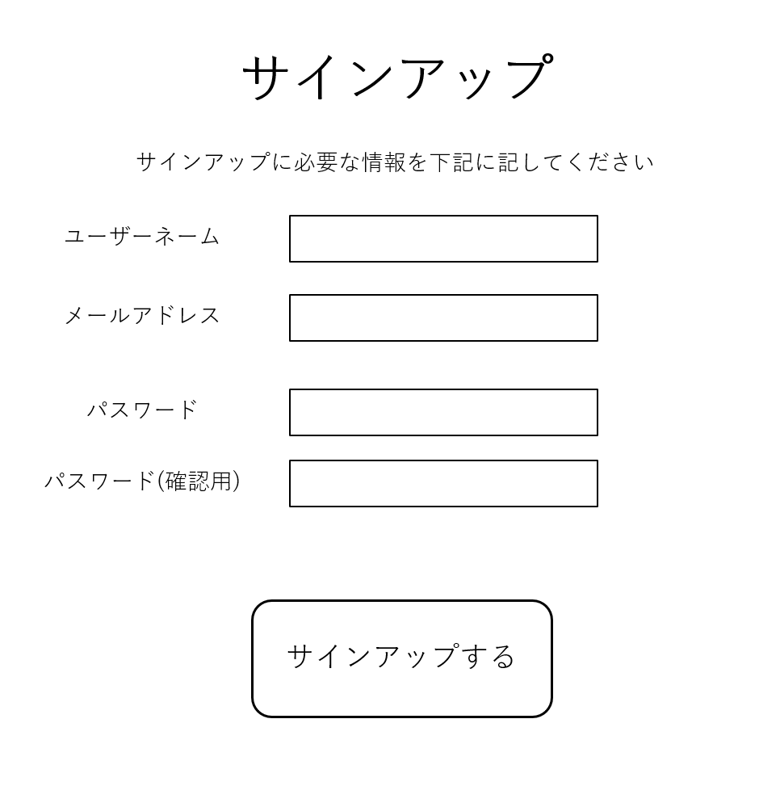

# 5.1 ページ概要

| 項目 | 内容 |
|------|------|
| ページID | P101105 |
| ページ名 | サインアップ |
| ページ概要 | ユーザ登録に必要な情報を入力させ、ユーザ登録を行う |

---

# 5.2 画面レイアウト

---

# 5.3 画面項目定義

| No | 画面項目名 | 画面項目種別 | 情報取得元 | 編集仕様 | 初期値 | 必須 |
|----|------------|--------------|------------|------------|------------|------|
| 1 | ユーザーネーム | テキスト入力 | - | 編集不可 | - | ○ |
| 2 | メールアドレス | テキスト入力 | - | 編集不可 | - | ○ |
| 3 | パスワード | テキスト入力 | - | 編集不可 | - | ○ |
| 4 | パスワード(確認用) | テキスト入力 | - | 編集不可 | - | ○ |
| 5 | サインアップボタン | ボタン | - | 編集不可 | - | - |

---

# 5.4 入出力一覧

| No | 入出力名 | 種別 | I/O | C | R | U | D | ロック対象 | 備考 |
|----|------------|------|-----|---|---|---|---|------------|------|
| 1 | ユーザーネーム | 画面入力 | I | - | - | - | - | - | - |
| 2 | メールアドレス | 画面入力 | I | - | - | - | - | - | - |
| 3 | パスワード | 画面入力 | I | - | - | - | - | - | - |
| 4 | パスワード(確認用) | 画面入力 | I | - | - | - | - | - | - |
| 5 | サインアップボタン押下 | 画面入力 | I | - | - | - | - | - | - |
| 6 | ユーザー登録処理 | DB更新 | O | ○ | - | - | - | - | - |
| 7 | ユーザー重複チェック | DB参照 | O | - | ○ | - | - | - | - |

---

# 5.5 画面イベント一覧

| No | 画面イベント名 | 発生タイミング | 画面イベント概要 | 正常時転移先画面 | サーバー通信 |
|----|----------------|----------------|------------------|------------------|----------------|
| 1 | 画面の初期表示 | サインアップ画面に移行時 | サインアップ画面表示 | サインアップ画面 | なし |
| 2 | サインアップ処理 | サインアップボタン押下時 | 入力内容の確認 | - | あり（同期） |
| 3 | ログインページ遷移 | 入力が正しい場合 | ログインページへ遷移 | ログインページ | なし |
| 4 | サインアップエラー | 入力が不正な場合 | エラー内容をアラート表示 | - | なし |

---

# 5.6 画面イベント詳細

| No | バリデーション内容 | メッセージID | 埋め込み文字列 | エラー時の処理 |
|----|----------------------|--------------|----------------|----------------|
| 1 | 全入力項目がドメイン条件を満たすかチェック | ドメイン別 | ドメイン別 | アラート表示 |

---

# 5.7 DBアクセス

| No | 処理 | アクセス種別 | 内容 |
|----|------|--------------|------|
| 1 | サインアップ認証 | C | IDとパスワードを保存 |