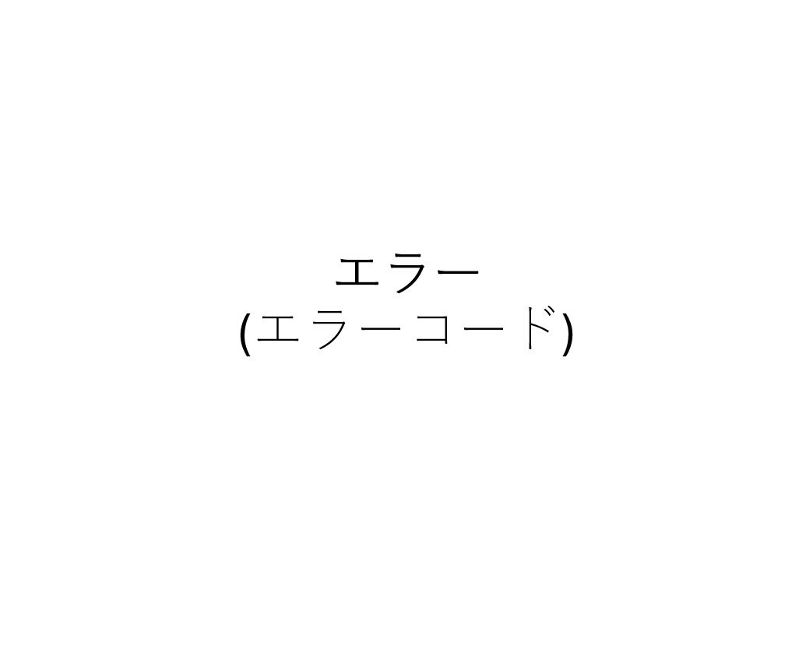

# 4.1 ページ概要

| 項目 | 内容 |
|------|------|
| ページID | P101104 |
| ページ名 | 汎用エラー |
| ページ概要 | 発生したエラーの内容を表示する |

---

# 4.2 画面レイアウト

---

# 4.3 画面項目定義

| No | 画面項目名 | 画面項目種別 | 情報取得元 | 編集仕様 | 初期値 | 必須 |
|----|------------|--------------|------------|------------|------------|------|
| 1 | エラーコード表示 | テキスト | サーバー返却値 | 編集不可 | - | - |

---

# 4.4 入出力一覧

| No | 入出力名 | 種別 | I/O | C | R | U | D | ロック対象 | 備考 |
|----|------------|------|-----|---|---|---|---|------------|------|
| 1 | エラーコード表示 | テキスト | O | - | ○ | - | - | - | - |

---

# 4.5 DBアクセス

| No | 処理 | アクセス種別 | 内容 |
|----|------|--------------|------|
| 1 | エラーコード表示 | R | エラーコードを確認する |