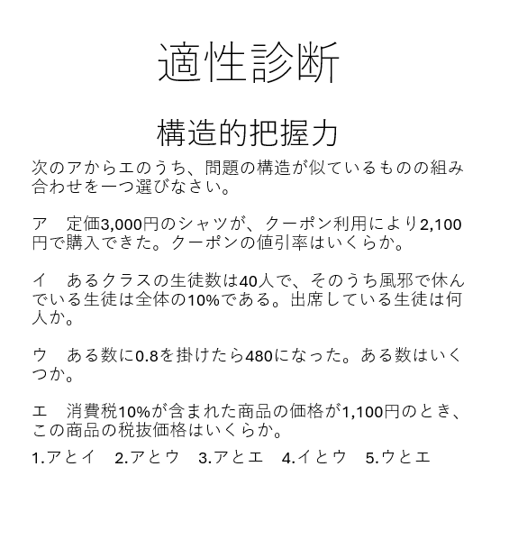

# 10.1 ページ概要

| 項目 | 内容 |
|------|------|
| ページID | P102105 |
| ページ名 | 適性診断 |
| ページ概要 | 3種類の能力について問題を解き、制限時間内の回答結果から適性の高い職業を診断する |

---

# 10.2 画面レイアウト

---

# 10.3 画面項目定義

| No | 画面項目名 | 画面項目種別 | 情報取得元 | 編集仕様 | 初期値 | 必須 |
|----|------------|--------------|------------|------------|------------|------|
| 1 | 質問一覧 | テキスト | DB | 編集不可 | - | - |
| 2 | 点数のボタン一覧 | ボタン | - | 編集不可 | 0 | ○ |
| 3 | 結果確認ボタン | ボタン | - | 編集不可 | - | - |

---

# 10.4 入出力一覧

| No | 入出力名 | 種別 | I/O | C | R | U | D | ロック対象 | 備考 |
|----|------------|------|-----|---|---|---|---|------------|------|
| 1 | 点数ボタン押下 | 画面入力 | I | - | - | - | - | - | - |
| 2 | 結果確認ボタン押下 | 画面入力 | I | ○ | - | - | - | - | - |

---

# 10.5 画面イベント一覧

| No | 画面イベント名 | 発生タイミング | 画面イベント概要 | 正常時転移先画面 | サーバー通信 | 備考 |
|----|----------------|----------------|------------------|------------------|----------------|------|
| 1 | 点数ボタン変色 | 点数ボタン押下時 | ボタンの色を変更 | - | なし | - |
| 2 | 結果確認 | 結果確認ボタン押下時 | 入力結果を確認し遷移先を決定 | - | なし | - |
| 3 | 結果の保存 | 結果確認ボタン押下時 | 入力結果を保存 | - | あり（同期） | - |
| 4 | ページの遷移 | 結果処理完了時 | 結果ページへ遷移 | 結果ページ | なし | 言語/非言語/構造把握の各能力に応じた結果画面を表示 |
| 5 | 初期画面表示 | マイページ遷移時 | マイページ表示 | マイページ | あり（非同期） | - |

---

# 10.6 画面イベント詳細

| No | バリデーション内容 | メッセージID | 埋め込み文字列 | エラー時の処理 |
|----|----------------------|--------------|----------------|----------------|
| 1 | 全入力項目がドメイン条件を満たすかチェック | ドメイン別 | ドメイン別 | アラート表示 |

---

# 10.7 DBアクセス

| No | 処理 | アクセス種別 | 内容 |
|----|------|--------------|------|
| 1 | 結果の保存 | C | 結果を保存 |