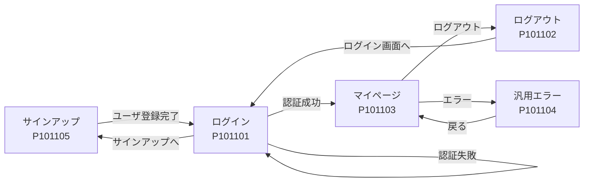
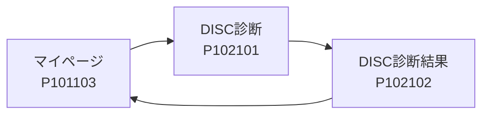
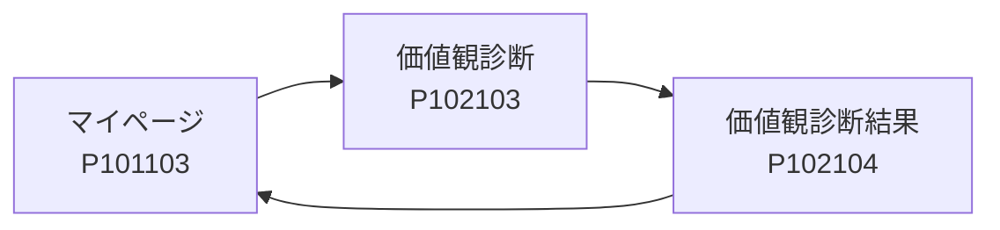
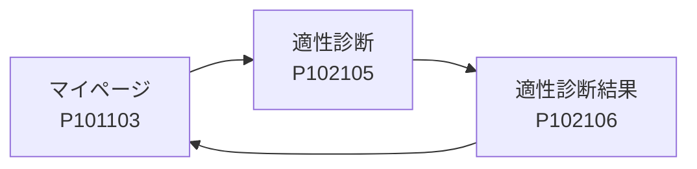
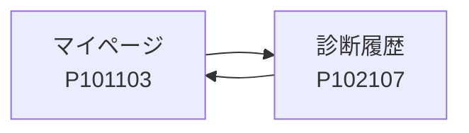

# 3. 画面遷移

## 1. ログイン

```mermaid
flowchart LR

Signup[サインアップ<br>P101105]
Login[ログイン<br>P101101]
Mypage[マイページ<br>P101103]
Logout[ログアウト<br>P101102]
Error[汎用エラー<br>P101104]

Signup -->|ユーザ登録完了| Login
Login -->|認証成功| Mypage
Login -->|認証失敗| Login
Login -->|サインアップへ| Signup

Mypage -->|ログアウト| Logout
Logout -->|ログイン画面へ| Login

Mypage -->|エラー| Error
Error -->|戻る| Mypage
```

---

## 2. 診断機能

### W102102 / DISC診断

```mermaid
flowchart LR
Mypage[マイページ\nP101103] --> DISC[DISC診断\nP102101]
DISC --> Result[DISC診断結果\nP102102]
Result --> Mypage
```

---

### W102103 / 価値観診断

```mermaid
flowchart LR
Mypage[マイページ\nP101103] --> Value[価値観診断\nP102103]
Value --> Result[価値観診断結果\nP102104]
Result --> Mypage
```

---

### W102104 / 適性診断

```mermaid
flowchart LR
Mypage[マイページ\nP101103] --> Aptitude[適性診断\nP102105]
Aptitude --> Result[適性診断結果\nP102106]
Result --> Mypage
```

---

### W102105 / 履歴確認

```mermaid
flowchart LR
Mypage[マイページ\nP101103] --> History[診断履歴\nP102107]
History --> Mypage
```